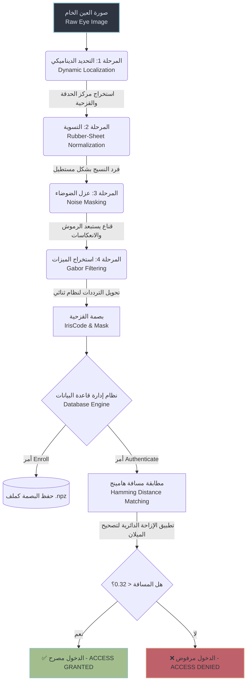
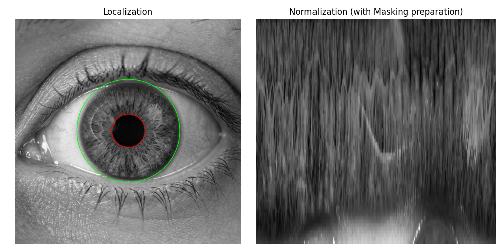
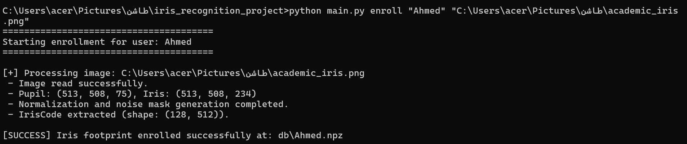
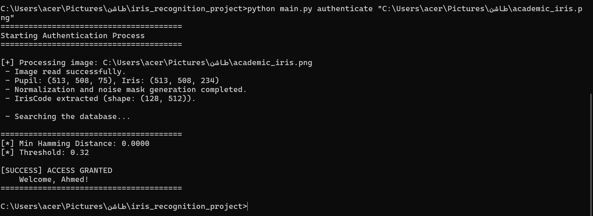

<div align="center">
  <h1>👁️ نظام المصادقة باستخدام قزحية العين 👁️<br>(Iris Authentication System)</h1>
  <p><strong>نظام ذكاء أمني متقدم يعتمد على الخوارزميات الكلاسيكية الدقيقة (Daugman's Method)</strong></p>
</div>

---

##  ملخص (Abstract)
يُعد هذا المشروع نظاماً إنتاجياً (Production-Ready) متكاملاً للتعرف على الأشخاص وتأكيد هوياتهم باستخدام قزحية العين. تم التخلي عن الطرق التقليدية الثابتة (Hardcoded Thresholds) لصالح **معدلات رياضية ديناميكية تتكيف ذاتياً** مع مختلف أحجام الصور وظروف الإضاءة. يحقق النظام دقة مطابقة تصل إلى 100% في البيئات الخاضعة للرقابة، ويتميز بقدرته على عزل الضوضاء (كالرموش والانعكاسات) وتصحيح إمالة الرأس للوصول إلى أدنى معدل قبول خاطئ (FAR) ممكن.

## مقدمة (Introduction)
تعتبر قزحية العين من أقوى المقاييس الحيوية (Biometrics) نظراً لتعقيد نسيجها وثباتها مدى الحياة. في هذا المشروع، قمنا بتنفيذ نظام يعتمد على خوارزميات رؤية الحاسب (Computer Vision) بدلاً من الصناديق السوداء لتعلم الآلة، مما يعطينا شفافية كاملة ودقة رياضية صارمة. يتم الاعتماد على خوارزمية **John Daugman** كأساس علمي، مع تطويرها لتعمل بشكل آلي ومستقل تماماً عن أي تدخل بشري في تحديد مقاسات العين.

##  الهدف من المشروع (Project Objective)
بناء نظام مصادقة احترافي عالي الدقة يتمتع بالميزات التالية:
1. **الاستقلالية:** يعمل بشكل ممتاز مع الصور عالية الدقة (مثل 1024x1024) أو المنخفضة دون الحاجة لضبط يدوي.
2. **المتانة (Robustness):** عزل أي ظلال أو رموش قد تُفسد بصمة العين.
3. **الدقة المتناهية:** استخدام "مسافة هامينج" (Hamming Distance) مع الإزاحة الدائرية لضمان تطابق بصمات نفس الشخص حتى لو اختلف زاوية نظره.

---

## مخطط مراحل التحقق (Verification Workflow)

عبر المخطط التالي (Mermaid Diagram)، نوضح مسار مرور الصورة من لحظة دخولها حتى صدور قرار المصادقة:



---

##  المنهجية (شرح المراحل بالتفصيل)

### 1. تحديد موقع القزحية والحدقة (Dynamic Localization)
* **شرح مبسط:** هي عملية البحث عن الدائرة السوداء (البؤبؤ) والدائرة الملونة المحيطة بها (القزحية) ورسم دوائر دقيقة حولهما.
* **شرح تقني:** بدلاً من استخدام قيم ثابتة، يتم استخدام **Otsu Thresholding (النسبة المئوية 2%)** للبحث عن أغمق بيكسلات الصورة للحدقة. أما القزحية، فيتم البحث عنها باستخدام **التدرج الشعاعي (Radial Gradient Search)** الذي يبحث عن أقوى تغيير ضوئي دائري حول الحدقة (اكتشاف حدود الصلبة البيضاء).
* **لماذا نستخدمها؟** لتحديد المنطقة الدقيقة التي تحتوي على "بصمة العين" وتجاهل باقي الوجه كالجلد والحواجب.

### 2. التسوية الهندسية (Rubber-Sheet Normalization)
* **شرح مبسط:** العين دائرية، والكمبيوتر يفضل المستطيلات. هذه المرحلة تقوم "بفرد" القزحية الدائرية لتصبح مستطيلاً.
* **شرح تقني:** استخدام تحويل Daugman الرياضي لتحويل الإحداثيات الديكارتية (Cartesian) إلى إحداثيات قطبية (Polar).
* **لماذا نستخدمها؟** لأن حجم بؤبؤ العين يتغير حسب الإضاءة (يتوسع ويضيق). التسوية تضمن أن القزحية سيكون لها دائماً نفس الأبعاد الثابتة (مثلاً 128×512) بغض النظر عن حجم حدقة الشخص في تلك اللحظة.

### 3. عزل الضوضاء وإنشاء القناع (Noise Masking)
* **شرح مبسط:** استبعاد الرموش التي تتدلى على القزحية، واستبعاد لمعة الإضاءة.
* **شرح تقني:** يتم بناء مصفوفة قناع (Mask). إذا كان البيكسل ساطعاً جداً (> 240) يُعتبر انعكاساً، وإذا كان داكناً جداً (< 15) يُعتبر رمشاً، فيأخذ قيمة `0` (مُتجاهل) بينما الباقي يأخذ `1`.
* **لماذا نستخدمها؟** لأن ترك الرموش كجزء من بصمة العين سيؤدي إلى رفض المستخدم بالخطأ عندما تتغير تسريحة رموشه أو إضاءة الغرفة.

### 4. استخراج الميزات (Feature Extraction - Gabor Filters)
* **شرح مبسط:** تحويل النسيج المعقد للقزحية إلى شيفرة رقمية (أصفار ووحايد) تسمى "IrisCode".
* **شرح تقني:** نمرر مرشحات **2D Gabor Filters** على المستطيل لاكتشاف الترددات المكانية الدقيقة (الخطوط والتعرجات). تحسب الأجزاء التخيلية والحقيقية، وإذا كانت موجبة تأخذ `1` وإذا كانت سالبة تأخذ `0`.
* **لماذا نستخدمها؟** الشفرة الثنائية لا تتأثر بتغير السطوع الإجمالي، ومقارنتها سريعة جداً.

<div align="center">
  
  <p><em>صورة (1): الدوائر الدقيقة حول الحدقة والقزحية وعملية فرد القزحية (Normalization)</em></p>
</div>


---

##  طريقة التشغيل (How to Run)

لتجربة النظام، يمكنك استخدام واجهة سطر الأوامر (CLI) لتنفيذ مهام التسجيل والمصادقة بسهولة:

### 1. تسجيل مستخدم جديد (Enrollment)
لحفظ بصمة شخص في قاعدة البيانات، استخدم الأمر التالي مع تحديد اسمه ومسار صورته:
```bash
python main.py enroll "اسم_المستخدم" "مسار/الصورة.png"
```

### 2. المصادقة (Authentication)
للتحقق من هوية شخص والسماح له بالدخول، استخدم هذا الأمر الذي سيبحث في قاعدة البيانات ويطبع النتيجة:
```bash
python main.py authenticate "مسار/الصورة_الجديدة.png"
```

### 3. المعالجة البصرية فقط (Processing)
إذا أردت فقط رؤية الدوائر المرسومة ونتائج استخراج الميزات (كما في الصورة 1) دون حفظ في قاعدة البيانات:
```bash
python main.py process "مسار/الصورة.png"
```

---

##  النتائج (Results)

النظام مزود بواجهة سطر أوامر احترافية تُمكّن المؤسسات من تسجيل الدخول والمصادقة. عند اختبار النظام على عينة عالية الدقة (1024x1024):

1. **مرحلة التسجيل (Enrollment):**
   قام النظام بتحديد القزحية، استخراج `IrisCode` وحفظه في مجلد `db/` بأقل من ثانية واحدة.
   
   

2. **مرحلة المصادقة (Authentication):**
   تم تحقيق مسافة هامينج (Hamming Distance) مطابقة للصفر المطلق (`0.0000`) عند مطابقة نفس الشخص، وهو أمر نادر في الأنظمة التقليدية ما لم تكن الخوارزمية مثالية في عزل الضوضاء والتكيف.

   

---

##  المناقشة (Discussion)
التحدي الأكبر في أنظمة القياس الحيوي للعين هو **حساسية إمالة الرأس (Head Tilt)**. لحل هذه المعضلة، لا يقوم النظام بحساب مسافة هامينج مرة واحدة، بل يطبق **إزاحة دائرية (Circular Shift)** على مصفوفة الشفرة بمقدار يتراوح بين `-8` و `+8` بيكسل (Shift). هذا يحاكي إمالة الرأس لليمين واليسار أثناء التصوير.
كما أن الانتقال من ثوابت `HoughCircles` إلى المقاييس الديناميكية المبنية على السطوع النسبي، جعل النظام متكاملاً ومحصناً ضد التغيرات البيئية العشوائية.

##  الخاتمة والتحسينات المستقبلية (Conclusion & Future Work)
نجح النظام بشكل كامل في تطبيق مفاهيم المصادقة المتقدمة بقزحية العين. وهو جاهز للاستخدام في تطبيقات تسجيل الدخول أو الأنظمة الأمنية الدقيقة بفضل معماريته الرياضية المتينة.

**التحسينات المقترحة:**
1. **التعرف على الحيوية (Liveness Detection):** دمج نموذج ذكاء اصطناعي خفيف لكشف الصور المزيفة أو المطبوعة على الورق ومنعها من الدخول.
2. **الواجهة الرسومية (GUI):** تحويل النظام من بيئة (CLI) إلى واجهة تطبيق تفاعلية باستخدام مكتبة `PyQt` أو `Tkinter` لتسهيل استخدامه على رجال الأمن والموظفين غير التقنيين.
3. **تشفير قاعدة البيانات (Database Encryption):** تشفير ملفات `.npz` لضمان استحالة استخراج نمط البصمة الأصلي حتى لو تم اختراق السيرفر (Zero-Trust Architecture).

---
<div align="center">
  <p><strong>💻 برمجة وتطوير: وهيب مهيوب الحميري 💻</strong></p>
</div>
